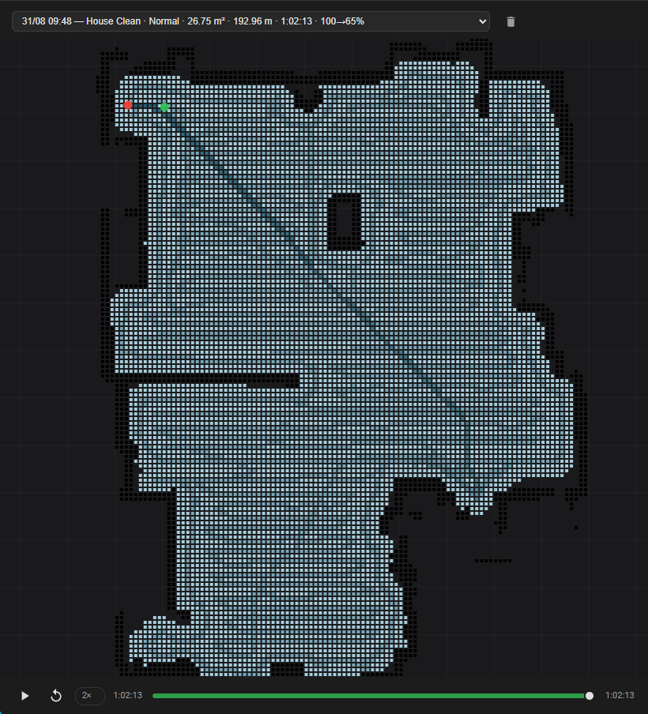

[](LICENSE)
[](https://github.com/renjfk/OpenNeato)
[](https://github.com/Leicas/OpenNeato)

<p align="center">
 
</p>

# OpenNeato — the Home Assistant side

**This fork exists for one thing: the Home Assistant integration under
[`custom_components/openneato/`](custom_components/openneato/).** It turns the OpenNeato ESP32 bridge
into a first-class Home Assistant device — vacuum, sensors, switches, buttons, a schedule you can set
from HA — plus a Lovelace card that draws a floor plan the robot builds for itself out of its own
LIDAR, and replays each cleaning on top of it.

Everything *underneath* that — the bridge firmware, the standalone web UI, the flash tool, the wiring,
the serial protocol — is upstream's work and is documented upstream. This README does not repeat it.

> [!IMPORTANT]
> **If you are not running Home Assistant, you want [renjfk/OpenNeato](https://github.com/renjfk/OpenNeato),
> not this.** That is the real project: the maintainer, the releases, the live demo, the documentation.
> This fork adds a Home Assistant layer on top and changes almost nothing else.

<p align="center">
  
</p>

<p align="center">
  <em>One cleaning replayed on the plan the robot built for itself. Black is wall, blue is cleaned floor,
  and the thin line is the path. Nothing here was drawn by hand or configured — the walls come from the
  robot's own LIDAR, accumulated over every run.</em>
</p>

---

## Thanks

This project is not ours from the ground up, and it would be dishonest to present it as if it were.

- **[renjfk](https://github.com/renjfk)** wrote OpenNeato. Neato shut down their cloud and their app and
  left a lot of perfectly good robots without a brain; renjfk reverse-engineered the debug-port protocol,
  built the ESP32 bridge firmware, the web UI, the scheduler, the OTA pipeline and the flash tool, and
  gave it all away under MIT. Every capability this integration exposes exists because that work exists
  first. If you find this useful, the thanks belong there — there is a
  [Ko-fi](https://ko-fi.com/renjfk), and testing prereleases and filing good bug reports is worth more.
- **[Leicas](https://github.com/Leicas)** maintains the fork this one descends from, and started the
  Home Assistant integration that the work here continues.

Upstream has never touched `custom_components/` and this fork has barely touched the firmware, so the
line between the two projects is unusually clean. What is ours is described below; everything else is
theirs.

---

## What this fork actually changes

| Area | Who wrote it | Status here |
|---|---|---|
| `custom_components/openneato/` — HA integration | this fork | **the whole point** |
| `custom_components/openneato/www/` — replay card | this fork | **the whole point** |
| `firmware/` — ESP32 bridge | upstream | tracks upstream; small additions only |
| `frontend/` — standalone web UI | upstream | tracks upstream, unmodified |
| `flash/` — flash tool | upstream | tracks upstream, unmodified |
| `docs/` — wiring, protocol, user guide | upstream | tracks upstream |

The firmware changes are deliberately small and exist only because the integration needed something the
bridge did not expose yet:

- `/api/sensors` — three range sensors (`WallSensor`, `DropSensorLeft`, `DropSensorRight`) that
  `GetAnalogSensors` returns and the bridge was dropping.
- `/api/lidar/buffer` — the bridge keeps LIDAR scans in a ring buffer so a Home Assistant restart, or a
  slow poll, stops costing them.
- `/api/history` hardening — bounded response, filename validation, retry on a body the bridge cuts
  short mid-send.
- `/api/system` — `resetReason` and a persistent `bootCount`, so an unattended restart says why.
- ntfy custom server + token + notify-on-start (upstream knows `ntfy.sh` only).
- A network watchdog that recovers the bridge when it answers but stops serving.

### Where to go for everything else

Do not look here for these — upstream documents them properly and keeps them current:

| You want | Go to |
|---|---|
| Wiring the ESP32 to the robot | [upstream user guide](https://github.com/renjfk/OpenNeato/blob/main/docs/user-guide.md) |
| Flashing, the serial menu, WiFi setup | [upstream README](https://github.com/renjfk/OpenNeato#installation) |
| The standalone web UI and what it can do | [upstream README](https://github.com/renjfk/OpenNeato) · [live demo](https://openneato-demo.renjfk.com/) |
| Which robots are supported | upstream — short answer: **Botvac D3–D7**, not D8/D9/D10 |
| OTA updates, dual-partition rollback | upstream |
| The 7-day scheduler running *on the ESP32* | upstream |
| ntfy push notifications | upstream |
| The Neato serial protocol | [`docs/neato-serial-protocol.md`](docs/neato-serial-protocol.md) |
| Firmware / frontend / flash-tool bugs | [upstream issues](https://github.com/renjfk/OpenNeato/issues) |

---

## Requirements

- A working OpenNeato bridge on your LAN — **flash it and wire it by following upstream first.** This
  integration talks to a bridge that already works; it is not a way to set one up.
- Home Assistant **2025.1 or newer** — the minimum HACS enforces, declared in
  [`hacs.json`](hacs.json).
- Bridge firmware **1.0+**. Some entities need more:
  - battery diagnostics — firmware `0.13+`
  - the three range sensors, the LIDAR ring buffer, `resetReason` — the firmware from this fork
  - older bridges do not break; the affected entities simply report `unknown`.
- Nothing else. `manifest.json` declares `"requirements": []` — the mapper draws with Pillow, which HA
  Core already ships.

---

## Installation

### 1. Add the repository to HACS

HACS → ⋮ → **Custom repositories** → add `https://github.com/Philou95/OpenNeato`, category
**Integration**. Then search for **OpenNeato**, install, and restart Home Assistant.

### 2. Add the integration

**Settings → Devices & Services → Add Integration → OpenNeato**, then enter the bridge's hostname or IP
(`neato.local`, or `192.168.1.42`). That is the whole configuration — no YAML.

The integration polls `/api/*` over your LAN every 5 seconds. `local_polling`, no cloud, no account.

### 3. Add the map card

Nothing to copy, nothing to register. The integration serves the card itself and registers the Lovelace
resource. Add a manual card:

```yaml
type: custom:openneato-replay-card
```

Useful options:

```yaml
type: custom:openneato-replay-card
title: Vacuum
floorplan: true        # draw the accumulated LIDAR plan behind the run (default: true)
autoplay: false        # start playing as soon as a session loads
height: fill           # or a number of pixels
map_rotation_offset: 0 # degrees, if you want the plan turned to match your idea of "up"
```

### 4. Run a cleaning

The floor plan does not exist until the robot has been round once. After the first clean you get walls;
after four or five they are worth looking at. See [How the map is built](#how-the-map-is-built) for what
is actually happening and how long it takes to settle.

---

## What you get

One device, with these entity groups.

**Vacuum** — `vacuum.<name>`: start, pause, stop, return to base, locate, spot clean, battery, status,
fan-speed presets (Eco / Auto / Intense), error reporting. Works with the standard HA vacuum cards.

> [!NOTE]
> **Pause, don't stop, if you want the robot to come home.** `return to base` sends an event the robot
> only acts on while a clean is running or paused. After a `stop` there is no run to return from, and
> the recovery path costs the robot its localisation — which is also the map's frame for that session.

**Map card** — [`openneato-replay-card`](custom_components/openneato/www/openneato-replay-card.js): a
canvas card that draws the accumulated floor plan, paints the cleaned area square by square as the run
replays over it, and gives you pan, zoom, a timeline scrubber and a session picker. It reads the
`openneato/sessions` and `openneato/session` websocket commands directly — no server-side rendering, no
image polling. A cleaning in progress appears in the picker labelled *in progress* and refreshes every
3 s, so you can watch the map being drawn.

**Sensors** — battery level / voltage / current / temperature, battery cycle count, cumulative cleaning
time, WiFi RSSI, free heap, storage used, uptime, bridge reset reason and boot count, motor RPMs, LIDAR
RPM, wall distance, floor distance left/right, error code and message, and last-clean statistics
(duration, area, distance, battery used, mode, end time).

**Binary sensors** — charging, external power, battery over-temp, battery failure, empty fuel, error
active, NTP synced, dustbin seated, left/right wheel lifted, DC jack, and the six bumper contacts
(front / side / LDS, left and right — disabled by default, they toggle on every bump).

**Switches** — eco mode, intense clean, bin-full detect, wall follower, schedule on/off, button-click
sounds, melodies, warning sounds, stealth LED, remote syslog, WiFi AP fallback, and per-event push
notifications (start / done / error / alert / docking).

**Numbers** — brush RPM, vacuum speed, side-brush power, stall threshold.
**Select** — navigation mode (Normal / Gentle / Deep / Quick).
**Text** — syslog server IP, ntfy topic, server, token.
**Time + switches** — a full 7-day schedule, two slots per day, settable from HA (14 `time` entities and
14 slot switches).
**Buttons** — restart bridge, restart robot, shutdown robot, locate, clear errors, format filesystem
(diagnostic, off by default), new battery (fuel-gauge recalibration after a pack swap, off by default).

Everything is translated through `strings.json`, and diagnostic entities are tagged so they cluster
under HA's Diagnostic section instead of cluttering the main card.

### Things the raw API gets wrong, and what the integration does about them

Three field names mislead, and the integration corrects for them rather than passing them through:

- **`errorCode` returns 200 when nothing is wrong** (`UI_ALERT_INVALID`). The *Error code* sensor
  reports `unknown` instead, so an idle robot does not look broken.
- **`chargerMAH` / `dischargeMAH` are milliamps, not milliamp-hours** — measured decreasing while the
  robot discharged. Exposed with a current device class.
- **`dcJackIn` is the robot's own barrel jack, not the dock.** "On dock" is `extPwrPresent`.

And one behaviour worth knowing: the coordinator tolerates a single hung endpoint without dropping the
whole device into "requires attention". State, charger and system are treated as critical; errors,
motors and history fall back to their last known value through a transient serial hang on the bridge.

---

## How the map is built

This is the substantial part of the fork, so it is worth explaining rather than just listing.

The robot's LIDAR is honest. Measured against a cardboard box at eight ranges with the robot standing
still, the returns are **accurate to about a centimetre** at every distance tested, and a flat cardboard
face comes back flat to 0.8–1.5 mm. Every centimetre of error on the finished plan is therefore *pose*,
not sensing — where the robot thought it was when it took the scan. The pipeline is a stack of
corrections to that, each one measured on real runs before it was kept:

1. **Scans are weighted by how still the robot was.** A scan takes 0.6–1.7 s and the robot keeps
   driving. Rotation dominates: 3.5° of turn displaces a wall point 2 m away by 12 cm, where 3.5 cm of
   travel displaces it by 3.5 cm. A motionless scan counts 1.0 and the weight falls to zero at the
   limits.
2. **The LIDAR is not on the centre of rotation.** The turret sits **103 mm behind** it — measured by
   turning 178° in place and fitting the range change against bearing. Uncorrected, the same wall gets
   stamped up to 206 mm apart depending on which way the robot faced.
3. **Each scan is matched onto the map built so far**, so odometry drift does not accumulate through an
   hour-long run. When that search hits the edge of its window the result is discarded: a clipped search
   has not converged on anything, and the edge of a window is not a measurement.
4. **The run's poses are then closed as a graph** — loop closures found and solved during the clean
   rather than all at once at the end, so the cost is constant per scan instead of quadratic.
5. **The session is fitted onto the accumulated map** — four quarter turns, then a fine angle sweep —
   and merged. A session that does not fit is refused rather than allowed to corrupt the map.
6. **The map forgets.** Free space read off the beams themselves erodes cells that are no longer there,
   so a chair that moves out is gone in about six cleanings while a wall seen every time is not touched.

Two properties of the accumulation are worth stating because they are what keeps the plan honest over
months:

- **A cell's value is evidence *per opportunity*, not evidence banked.** The grid is rescaled after each
  merge so the top of its distribution stays put, which holds the draw threshold still without closing
  the gap between "seen every cleaning" and "seen twice". A per-cell ceiling was tried first and does
  the opposite: it stops the core of a wall growing while the fringe beside it keeps climbing, and the
  walls thicken run after run.
- **The replay is drawn in the same frame as the walls.** The correction the mapper applied to the
  poses is stored with the session and re-applied to the robot's own path log — as a rotation *and* a
  shift, because the rotation is the larger half of it.

### What it converges to

On the reference home, a single cleaning draws its walls **2 cells thick — 50 mm**, and the accumulated
map settles at the same, which is as thin as the data supports. Coverage that falls on a drawn wall sits
around **1.3 %**, which is a 319 mm cleaning swath lapping onto a wall the robot followed, not a
misalignment.

An existing map that predates the rescaling converges rather than jumping: measured by replaying real
cleanings, thickness holds for three merges, improves at the fourth, and reaches its floor around the
eleventh.

---

## Test conditions

Everything above was measured on one setup. It is a real home, not a lab, and a second one might behave
differently — so here is exactly what was tested, and on what.

**Robot** — Neato **Botvac D6 Connected**, software `4.5.3.189.0`, LDS `V2.7.4`, main board rev 4,
smart battery (`bq40z50`) manufactured 2024-02. Robot width **319 mm**, main brush 280 mm — the cleaned
swath is the robot's width, not the brush's, because the side brush sweeps the strip beyond the main
brush into its path.

**Bridge** — ESP32-C3, OpenNeato firmware from this fork, wired to the robot's debug port. WiFi transmit
power is deliberately below the firmware default on this install; the supply is not perfectly stable and
a higher transmit power browns it out, which looks exactly like a WiFi problem and is not one.

**Home Assistant** — HA Core 2026.8.x on a **Raspberry Pi 5**, HACS install, integration talking to the
bridge over a plain LAN. The pose-graph timings quoted in the changelog (~85 s in the executor at the
end of an hour-long clean) are Pi 5 figures; a Pi 4 is roughly twice that.

**The home** — a single floor of about **27 m² of cleaned area** per run, taking 55 to 62 minutes and
185 to 195 m of travel. Broadly rectangular, lightly furnished, few thin obstacles. **This matters**: a
cluttered home with many chair legs, or a mirrored or glass-walled room, will not produce the same
numbers, and a long featureless corridor is the case where scan matching has the least to work with —
position *along* a corridor is not observable from a LIDAR scan, and that is a known weak point of the
pipeline rather than a bug that was fixed.

**Calibration target** — a **50 × 29 cm cardboard box, 33.5 cm tall**, in good condition, placed in the
open. Measured on the rendered plan as the **outermost cell in each direction still carrying ≥ 20 % of
that wall's peak weight**, which is the box's *outer surface* — the only face the robot ever sees.

> [!WARNING]
> That estimator is not interchangeable with the obvious ones, and the difference is not small. On the
> same map the same box measures 32.5 × 57.5 cm by bounding box, 27.5 × 50.0 cm axis-to-axis, 25.9 ×
> 47.2 cm peak-to-peak, and 30.0 × 52.5 cm by the outer-surface rule. A measurement's reference frame is
> part of the measurement. Sweep the threshold before believing a number: from 10 % to 30 % the
> outer-surface figure does not move, which is what makes it a result rather than a setting.

**Honest accuracy on the accumulated plan: +1.0 / +2.5 cm** on a 29 × 50 cm target. Earlier
sub-centimetre claims were an artefact of the wrong estimator.

**Sample size** — the mapping work was validated by replaying real cleanings offline against the real
merge code: seven full sessions of 430 to 670 scans each, plus a stored map of seventeen accumulated
cleanings. One run's scans are kept in `config/openneato_captures.json` for exactly this, so a mapping
change can be tried against real returns instead of shipped and judged a cycle later.

**Not tested at all**: D3, D4, D5, D7. Multi-floor homes. Anything other than a Pi 5. Robots with a
different LDS revision. The lever arm (103 mm) and the swath (319 mm) are D6 measurements and are very
likely wrong for another model.

---

## Change history

Full per-version notes, with the measurements behind each change, live in
[`custom_components/openneato/CHANGELOG.md`](custom_components/openneato/CHANGELOG.md). The shape of the
project, in order:

### Mapping and the replay card (1.13 → current)

| Version | What landed |
|---|---|
| **1.25** | The correction handed to the replay became a rotation *and* a shift, not an averaged shift — the run stopped being drawn beside its own walls. The grid is rescaled instead of capped, so walls stop thickening with every cleaning. A clipped scan-match result is refused instead of applied. `resetReason` / `bootCount` on the bridge. The card says the map is being rebuilt instead of blaming the robot for it. |
| **1.24** | The run in progress is placed on the map without waiting for the merge. Firmware network watchdog. Map protected from a bridge that answers badly. |
| **1.23** | The map can be watched while the robot is still cleaning. Scans weighted by how still the robot was. Pose-graph loop closure. The bridge keeps the scans, so an outage stops costing them. The map learns to forget what is no longer there. |
| **1.22** | Three range sensors the bridge was dropping — wall distance, floor distance left and right. |
| **1.21** | Navigation mode recorded per session. Fixed the session picker freezing HA. |
| **1.20** | The wall threshold follows the map's own distribution instead of standing still. |
| **1.19** | Delete button on the card. `return to base` made to work on a stopped robot. Returning to base no longer reported as an error. |
| **1.18** | Six bumper binary sensors, off by default. |
| **1.17** | **Self-building floor plan from the LIDAR** — the accumulated occupancy grid the whole map story starts from. |
| **1.13 – 1.16** | The interactive replay card, and the alignment work that stopped the view shifting between cleanings. |

### Before the map (1.0 → 1.12)

| Version | What landed |
|---|---|
| **1.12** | The canvas replay card replaced the `LIDAR map` and `Cleaning replay` camera entities (`Platform.CAMERA` dropped). Per-session alignment. HA-settable 7-day schedule. `chargerMAH` / `dischargeMAH` corrected from mAh to mA; the `errorCode` 200 sentinel stopped being reported as an error. |
| **1.11** | `notify_on_start` and AP-fallback switches; ntfy topic / server / token text entities. |
| **1.10** | Battery diagnostics — current, voltage, cycle count, cumulative cleaning time — and the `New battery` calibration button. |
| **1.6 – 1.9** | The `Cleaning replay` GIF camera, corruption-tolerant `/api/history` parsing, filename validation and a response cap. |
| **1.2 – 1.3** | Last-clean statistics sensors, the first `LIDAR map` camera, coordinator resilience, Pillow dropped from declared dependencies. |
| **1.0 – 1.1** | The integration itself: config flow, vacuum, sensors, switches, buttons. |

---

## Reporting bugs

- **Anything under `custom_components/openneato/`** — the integration, the card, the mapper:
  [this fork's issues](https://github.com/Philou95/OpenNeato/issues).
- **Firmware, frontend, flash tool, wiring, the protocol**:
  [upstream issues](https://github.com/renjfk/OpenNeato/issues). Please check there first — most of what
  can go wrong lives upstream, and upstream is where it gets fixed for everybody.

A useful report for a mapping problem includes a copy of `config/.storage/openneato_*_lidar_map` and, if
you have it, `config/openneato_captures.json`. A complaint about the map is a complaint about a picture,
and the picture is three transforms away from the data — those two files are what makes it possible to
tell which of the three is at fault.

> [!NOTE]
> This is beta, and so is upstream. Rough edges are expected.

---

## Development

The integration is plain Python with no external dependencies. Lint with `ruff`. There is no test suite;
mapping changes are validated by replaying recorded sessions against the real merge code, which is what
`config/openneato_captures.json` exists for.

For the firmware, frontend and flash tool, follow upstream's build instructions — they are unchanged
here.

## License

[MIT](LICENSE), same as upstream.
